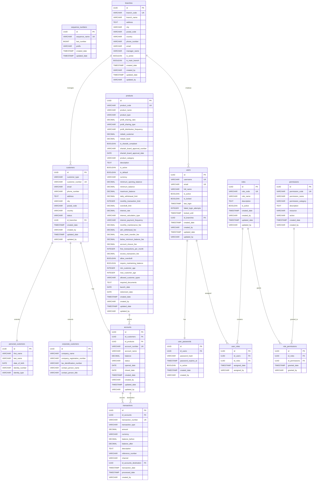

# Database Schema Diagram

This diagram represents the database schema for the Mini Bank application based on the migration files.

## Table Relationships

### Banking Core Relationships

#### customers → accounts (One-to-Many)
- One customer can have multiple accounts
- Each account belongs to exactly one customer
- Foreign key: `accounts.id_customers` → `customers.id`

#### products → accounts (One-to-Many)
- One product can be used for multiple accounts
- Each account is based on exactly one product
- Foreign key: `accounts.id_products` → `products.id`

#### accounts → transactions (One-to-Many)
- One account can have multiple transactions
- Each transaction belongs to exactly one account
- Foreign key: `transactions.id_accounts` → `accounts.id`

#### accounts → transactions (One-to-Many, for transfers)
- One account can be the destination for multiple transfer transactions
- Each transfer transaction can have one destination account (optional)
- Foreign key: `transactions.id_accounts_destination` → `accounts.id`

### Multi-Branch Organizational Relationships

#### branches → customers (One-to-Many)
- One branch can manage multiple customers
- Each customer is assigned to exactly one branch
- Foreign key: `customers.id_branches` → `branches.id`

#### branches → users (One-to-Many)
- One branch can employ multiple users
- Each user is assigned to exactly one branch
- Foreign key: `users.id_branches` → `branches.id`

### User Authentication & Authorization Relationships

#### users → user_passwords (One-to-One)
- Each user has exactly one active password record
- Password is stored separately for easier CRUD operations
- Foreign key: `user_passwords.id_users` → `users.id`

#### users → user_roles (One-to-Many)
- One user can have multiple roles (though typically one role per user)
- Each user-role assignment is tracked separately
- Foreign key: `user_roles.id_users` → `users.id`

#### roles → user_roles (One-to-Many)
- One role can be assigned to multiple users
- Each user-role assignment belongs to exactly one role
- Foreign key: `user_roles.id_roles` → `roles.id`

#### roles → role_permissions (One-to-Many)
- One role can have multiple permissions
- Each permission assignment belongs to exactly one role
- Foreign key: `role_permissions.id_roles` → `roles.id`

#### permissions → role_permissions (One-to-Many)
- One permission can be granted to multiple roles
- Each role-permission assignment involves exactly one permission
- Foreign key: `role_permissions.id_permissions` → `permissions.id`

## Key Features

### Customer Types
- **PERSONAL**: Individual customers with personal information fields
- **CORPORATE**: Business customers with company information fields

### Product Types
- **SAVINGS**: Savings accounts with interest earnings
- **CHECKING**: Current accounts with overdraft facilities
- **LOAN**: Loan products (structure prepared)
- **CREDIT_CARD**: Credit card products (structure prepared)
- **DEPOSIT**: Term deposit products (structure prepared)

### Transaction Types
- **DEPOSIT**: Money deposited into account
- **WITHDRAWAL**: Money withdrawn from account
- **TRANSFER_IN**: Incoming transfer from another account
- **TRANSFER_OUT**: Outgoing transfer to another account
- **INTEREST**: Interest earned/charged
- **FEE**: Various fees charged

### Transaction Channels
- **TELLER**: Branch teller transactions
- **ATM**: ATM transactions
- **ONLINE**: Online banking
- **MOBILE**: Mobile app transactions
- **TRANSFER**: Inter-bank transfers

### Account Status
- **ACTIVE**: Normal operating account
- **INACTIVE**: Temporarily suspended account
- **CLOSED**: Permanently closed account
- **FROZEN**: Frozen due to compliance issues

## User Authentication & Authorization Features

### User Management
- **Separate Password Storage**: Passwords stored in dedicated table for easier CRUD operations
- **Account Locking**: Automatic account locking after failed login attempts
- **Password Expiration**: Configurable password expiration dates
- **User Status Tracking**: Active/inactive user management with audit trail

### Role-Based Access Control (RBAC)
- **Three Main Roles**:
  - **CUSTOMER_SERVICE**: Customer registration and account opening
  - **TELLER**: Financial transaction processing
  - **BRANCH_MANAGER**: Full access with monitoring and approval capabilities

### Permission System
- **Granular Permissions**: Fine-grained permission control by resource and action
- **Dynamic Menu Display**: UI menus displayed based on user permissions
- **Permission Categories**:
  - **CUSTOMER**: Customer management operations
  - **ACCOUNT**: Account management operations  
  - **TRANSACTION**: Transaction processing operations
  - **PRODUCT**: Product information access
  - **USER**: User management operations
  - **REPORT**: Business reporting access
  - **AUDIT**: System audit log access

### Multi-Branch Management
- **Branch Organizational Structure**: Hierarchical branch management system
- **Branch-Based Access Control**: Users and customers segmented by branch
- **Main Branch Support**: Special designation for headquarters/main office
- **Branch Isolation**: Data and operations isolated per branch for security
- **Cross-Branch Admin Access**: System administrators can access all branches

### Default Setup
- **Admin User**: Default admin account with Branch Manager role
  - Username: `admin`
  - Email: `admin@yopmail.com`
  - Password: `minibank123` (BCrypt hashed: `$2a$10$6tjICoD1DhK3r82bD4NiSuJ8A4xvf5osh96V7Q4BXFvIXZB3/s7da`)
- **Main Branch**: Default branch for initial setup
  - Branch Code: `MAIN`
  - Branch Name: `Main Branch (Kantor Pusat)`
  - Location: Jakarta
  - Status: Active

### Sample Data Loaded by Migrations

#### Initial Sequence Numbers (V002)
- Customer Number: Starting from C1000001 (prefix: C, last_number: 1000000)
- Account Number: Starting from A2000001 (prefix: A, last_number: 2000000)
- Transaction Number: Starting from T3000001 (prefix: T, last_number: 3000000)

#### Pre-configured Products (V002)
| Code | Name | Type | Nisbah | Min Opening | Customer Types |
|------|------|------|--------|-------------|----------------|
| TAB001 | Tabungan Wadiah Basic | TABUNGAN_WADIAH | - | 50,000 | PERSONAL |
| TAB002 | Tabungan Mudharabah Premium | TABUNGAN_MUDHARABAH | 70:30 | 1,000,000 | PERSONAL |
| DEP001 | Deposito Mudharabah | DEPOSITO_MUDHARABAH | 70:30 | 100,000 | PERSONAL |
| PEM001 | Pembiayaan Murabahah | PEMBIAYAAN_MURABAHAH | - | 5,000,000 | CORPORATE |
| PEM002 | Pembiayaan Musharakah | PEMBIAYAAN_MUSHARAKAH | 60:40 | 2,000,000 | PERSONAL |

#### Sample Customers (V002, V007)
**Personal Customers:**
- C1000001: Ahmad Suharto (KTP: 3271081503850001) - Main Branch
- C1000002: Siti Nurhaliza (KTP: 3271082207900002) - Main Branch
- C1000004: Budi Santoso (KTP: 3271081011880003) - Main Branch
- C1000006: Dewi Lestari (KTP: 3271081805920004) - Main Branch

**Corporate Customers:**
- C1000003: PT. Teknologi Maju (Reg: 1234567890123456) - Main Branch

#### Branch Structure (V005, V007)
- **MAIN**: Main Branch (Kantor Pusat) - Jakarta - Active

#### System Users (V004, V007)
All users have password `minibank123` and are assigned to Main Branch:
- **Branch Managers**: admin, manager1, manager2
- **Tellers**: teller1, teller2, teller3
- **Customer Service**: cs1, cs2, cs3

### Security Features
- **Failed Login Tracking**: Automatic account locking after multiple failed attempts
- **Session Management**: Last login timestamp tracking
- **Audit Trail**: Full audit trail for user actions with created_by/updated_by fields
- **Password Security**: BCrypt password hashing with secure storage