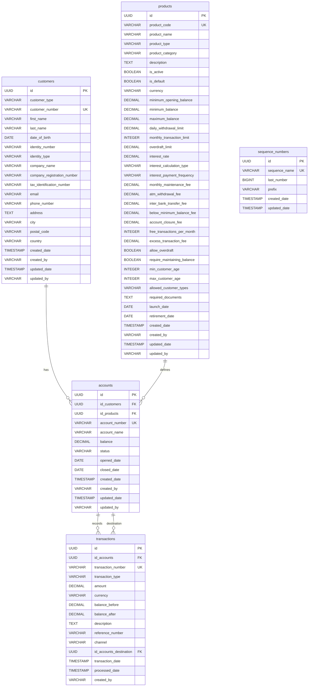

# Database Schema Diagram

This diagram represents the database schema for the Mini Bank application based on the migration files.

## Table Relationships

### customers → accounts (One-to-Many)
- One customer can have multiple accounts
- Each account belongs to exactly one customer
- Foreign key: `accounts.id_customers` → `customers.id`

### products → accounts (One-to-Many)
- One product can be used for multiple accounts
- Each account is based on exactly one product
- Foreign key: `accounts.id_products` → `products.id`

### accounts → transactions (One-to-Many)
- One account can have multiple transactions
- Each transaction belongs to exactly one account
- Foreign key: `transactions.id_accounts` → `accounts.id`

### accounts → transactions (One-to-Many, for transfers)
- One account can be the destination for multiple transfer transactions
- Each transfer transaction can have one destination account (optional)
- Foreign key: `transactions.id_accounts_destination` → `accounts.id`

## Key Features

### Customer Types
- **PERSONAL**: Individual customers with personal information fields
- **CORPORATE**: Business customers with company information fields

### Product Types
- **SAVINGS**: Savings accounts with interest earnings
- **CHECKING**: Current accounts with overdraft facilities
- **LOAN**: Loan products (structure prepared)
- **CREDIT_CARD**: Credit card products (structure prepared)
- **DEPOSIT**: Term deposit products (structure prepared)

### Transaction Types
- **DEPOSIT**: Money deposited into account
- **WITHDRAWAL**: Money withdrawn from account
- **TRANSFER_IN**: Incoming transfer from another account
- **TRANSFER_OUT**: Outgoing transfer to another account
- **INTEREST**: Interest earned/charged
- **FEE**: Various fees charged

### Transaction Channels
- **TELLER**: Branch teller transactions
- **ATM**: ATM transactions
- **ONLINE**: Online banking
- **MOBILE**: Mobile app transactions
- **TRANSFER**: Inter-bank transfers

### Account Status
- **ACTIVE**: Normal operating account
- **INACTIVE**: Temporarily suspended account
- **CLOSED**: Permanently closed account
- **FROZEN**: Frozen due to compliance issues