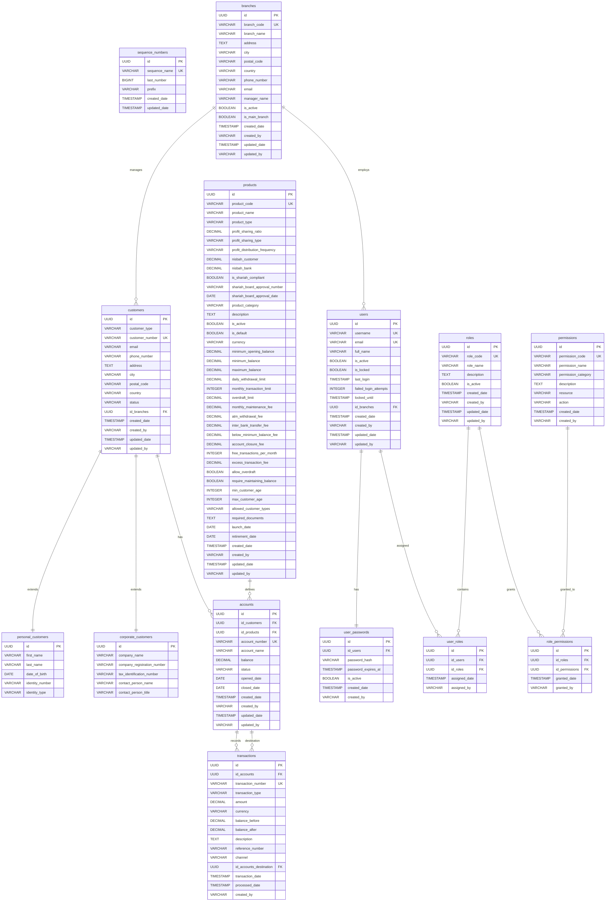

# Database Documentation

This document provides comprehensive documentation for the Mini Bank application database schema, including visual diagrams, detailed table specifications, relationships, and migration information.

## 🔄 Recent Updates
**Last Updated**: 2024-12-19 - Updated to match current migration files V001-V004

### Key Changes:
- ✅ **Updated Migration History**: Corrected to reflect actual 4 migration files (V001-V004)
- ✅ **Branch Integration**: Added missing `id_branches` foreign key to accounts table
- ✅ **Constraint Documentation**: Added comprehensive business rules constraints for products, accounts, and transactions
- ✅ **Sample Data Updates**: Updated branch data, user assignments, and sample customer information to match V002 migration
- ✅ **Islamic Banking Constraints**: Highlighted critical `chk_nisbah_sum` constraint for Islamic banking compliance
- ✅ **Index Updates**: Corrected indexes to match actual migration implementation

## Schema Overview

The database consists of three main modules:
1. **Banking Core Module**: Customer, product, account, and transaction management
2. **User Authentication Module**: User management, roles, and permissions
3. **Multi-Branch Module**: Branch management and organizational structure

## Database Schema Diagram

## Banking Core Tables

### customers
Base table for all customer types using joined table inheritance.

| Column | Type | Constraints | Description |
|--------|------|-------------|-------------|
| id | UUID | PRIMARY KEY, DEFAULT gen_random_uuid() | Unique identifier |
| customer_type | VARCHAR(20) | NOT NULL, CHECK IN ('PERSONAL', 'CORPORATE') | Customer type discriminator |
| customer_number | VARCHAR(50) | UNIQUE NOT NULL | Business customer number |
| email | VARCHAR(100) | | Customer email address |
| phone_number | VARCHAR(20) | | Phone number |
| address | TEXT | | Street address |
| city | VARCHAR(100) | | City |
| postal_code | VARCHAR(10) | | Postal/ZIP code |
| country | VARCHAR(50) | DEFAULT 'Indonesia' | Country |
| status | VARCHAR(20) | DEFAULT 'ACTIVE', CHECK IN ('ACTIVE', 'INACTIVE', 'CLOSED', 'FROZEN') | Customer account status |
| id_branches | UUID | NOT NULL, FK to branches(id) | Branch assignment |
| created_date | TIMESTAMP | DEFAULT CURRENT_TIMESTAMP | Record creation timestamp |
| created_by | VARCHAR(100) | | User who created the record |
| updated_date | TIMESTAMP | DEFAULT CURRENT_TIMESTAMP | Last update timestamp |
| updated_by | VARCHAR(100) | | User who last updated the record |

**Indexes:**
- `idx_customers_customer_number` ON customer_number
- `idx_customers_customer_type` ON customer_type  
- `idx_customers_email` ON email (WHERE email IS NOT NULL)
- `idx_customers_branch` ON id_branches

### personal_customers
Extension table for personal customer specific fields.

| Column | Type | Constraints | Description |
|--------|------|-------------|-------------|
| id | UUID | PRIMARY KEY, FK to customers(id) | Inherited from customers |
| first_name | VARCHAR(100) | NOT NULL | First name |
| last_name | VARCHAR(100) | NOT NULL | Last name |
| date_of_birth | DATE | NOT NULL | Date of birth |
| identity_number | VARCHAR(50) | NOT NULL | ID number (KTP/Passport/SIM) |
| identity_type | VARCHAR(20) | NOT NULL, CHECK IN ('KTP', 'PASSPORT', 'SIM') | Type of ID |

**Indexes:**
- `idx_personal_customers_identity_number` ON identity_number
- `idx_personal_customers_name` ON first_name, last_name

### corporate_customers
Extension table for corporate customer specific fields.

| Column | Type | Constraints | Description |
|--------|------|-------------|-------------|
| id | UUID | PRIMARY KEY, FK to customers(id) | Inherited from customers |
| company_name | VARCHAR(200) | NOT NULL | Company name |
| company_registration_number | VARCHAR(100) | NOT NULL | Business registration number |
| tax_identification_number | VARCHAR(50) | | Tax ID number |
| contact_person_name | VARCHAR(100) | | Contact person name |
| contact_person_title | VARCHAR(100) | | Contact person title |

**Indexes:**
- `idx_corporate_customers_company_registration_number` ON company_registration_number
- `idx_corporate_customers_company_name` ON company_name
- `idx_corporate_customers_tax_id` ON tax_identification_number (WHERE tax_identification_number IS NOT NULL)

### products
Banking product configurations and rules.

| Column | Type | Constraints | Description |
|--------|------|-------------|-------------|
| id | UUID | PRIMARY KEY, DEFAULT gen_random_uuid() | Unique identifier |
| product_code | VARCHAR(20) | UNIQUE NOT NULL | Business product code |
| product_name | VARCHAR(100) | NOT NULL | Product display name |
| product_type | VARCHAR(50) | NOT NULL, CHECK IN (...) | Product category |
| nisbah_customer | DECIMAL(5,4) | | Customer profit share (0.0000-1.0000) |
| nisbah_bank | DECIMAL(5,4) | | Bank profit share (0.0000-1.0000) |
| is_shariah_compliant | BOOLEAN | DEFAULT false | Islamic banking compliance |
| minimum_opening_balance | DECIMAL(20,2) | DEFAULT 0.00 | Minimum opening balance |
| minimum_balance | DECIMAL(20,2) | DEFAULT 0.00 | Minimum maintaining balance |
| allowed_customer_types | VARCHAR(50) | CHECK IN ('PERSONAL', 'CORPORATE', 'BOTH') | Allowed customer types |

**Critical Constraints:**
- `chk_nisbah_sum`: `(nisbah_customer + nisbah_bank = 1.0000)` - Islamic banking compliance
- `chk_minimum_balances`: `minimum_opening_balance >= minimum_balance`

### accounts
Customer account instances based on products.

| Column | Type | Constraints | Description |
|--------|------|-------------|-------------|
| id | UUID | PRIMARY KEY, DEFAULT gen_random_uuid() | Unique identifier |
| id_customers | UUID | NOT NULL, FK to customers(id) | Account owner |
| id_products | UUID | NOT NULL, FK to products(id) | Product type |
| account_number | VARCHAR(50) | UNIQUE NOT NULL | Business account number |
| account_name | VARCHAR(200) | NOT NULL | Account display name |
| balance | DECIMAL(20,2) | DEFAULT 0.00 | Current account balance |
| status | VARCHAR(20) | DEFAULT 'ACTIVE', CHECK IN ('ACTIVE', 'INACTIVE', 'CLOSED', 'FROZEN') | Account status |
| opened_date | DATE | NOT NULL | Account opening date |
| closed_date | DATE | | Account closure date |

**Indexes:**
- `idx_accounts_account_number` ON account_number
- `idx_accounts_customer` ON id_customers
- `idx_accounts_product` ON id_products
- `idx_accounts_status` ON status

### transactions
All financial transaction records.

| Column | Type | Constraints | Description |
|--------|------|-------------|-------------|
| id | UUID | PRIMARY KEY, DEFAULT gen_random_uuid() | Unique identifier |
| id_accounts | UUID | NOT NULL, FK to accounts(id) | Source account |
| transaction_number | VARCHAR(50) | UNIQUE NOT NULL | Business transaction number |
| transaction_type | VARCHAR(50) | NOT NULL, CHECK IN ('DEPOSIT', 'WITHDRAWAL', 'TRANSFER_IN', 'TRANSFER_OUT', 'FEE') | Transaction type |
| amount | DECIMAL(20,2) | NOT NULL, CHECK > 0 | Transaction amount |
| currency | VARCHAR(3) | DEFAULT 'IDR' | Currency code |
| balance_before | DECIMAL(20,2) | NOT NULL | Balance before transaction |
| balance_after | DECIMAL(20,2) | NOT NULL | Balance after transaction |
| channel | VARCHAR(20) | CHECK IN ('TELLER', 'ATM', 'ONLINE', 'MOBILE', 'TRANSFER') | Transaction channel |
| id_accounts_destination | UUID | FK to accounts(id) | Destination account (for transfers) |
| transaction_date | TIMESTAMP | DEFAULT CURRENT_TIMESTAMP | Transaction timestamp |

**Indexes:**
- `idx_transactions_transaction_number` ON transaction_number
- `idx_transactions_account` ON id_accounts
- `idx_transactions_date` ON transaction_date
- `idx_transactions_type` ON transaction_type

## Multi-Branch Tables

### branches
Organizational branch structure.

| Column | Type | Constraints | Description |
|--------|------|-------------|-------------|
| id | UUID | PRIMARY KEY, DEFAULT gen_random_uuid() | Unique identifier |
| branch_code | VARCHAR(20) | UNIQUE NOT NULL | Business branch code |
| branch_name | VARCHAR(100) | NOT NULL | Branch display name |
| address | TEXT | | Branch address |
| city | VARCHAR(100) | | Branch city |
| phone_number | VARCHAR(20) | | Branch phone |
| email | VARCHAR(100) | | Branch email |
| manager_name | VARCHAR(100) | | Branch manager name |
| is_active | BOOLEAN | DEFAULT true | Active status |
| is_main_branch | BOOLEAN | DEFAULT false | Main branch flag |

## User Authentication Tables

### users
System user accounts.

| Column | Type | Constraints | Description |
|--------|------|-------------|-------------|
| id | UUID | PRIMARY KEY, DEFAULT gen_random_uuid() | Unique identifier |
| username | VARCHAR(50) | UNIQUE NOT NULL | Login username |
| email | VARCHAR(100) | UNIQUE NOT NULL | User email |
| full_name | VARCHAR(200) | NOT NULL | Full display name |
| is_active | BOOLEAN | DEFAULT true | Account active status |
| is_locked | BOOLEAN | DEFAULT false | Account locked status |
| failed_login_attempts | INTEGER | DEFAULT 0 | Failed login counter |
| locked_until | TIMESTAMP | | Lock expiration time |
| id_branches | UUID | NOT NULL, FK to branches(id) | Branch assignment |

### user_passwords
Secure password storage.

| Column | Type | Constraints | Description |
|--------|------|-------------|-------------|
| id | UUID | PRIMARY KEY, DEFAULT gen_random_uuid() | Unique identifier |
| id_users | UUID | NOT NULL, FK to users(id) | User reference |
| password_hash | VARCHAR(255) | NOT NULL | BCrypt password hash |
| password_expires_at | TIMESTAMP | | Password expiration |
| is_active | BOOLEAN | DEFAULT true | Active password flag |

### roles
System roles definition.

| Column | Type | Constraints | Description |
|--------|------|-------------|-------------|
| id | UUID | PRIMARY KEY, DEFAULT gen_random_uuid() | Unique identifier |
| role_code | VARCHAR(50) | UNIQUE NOT NULL | Role identifier |
| role_name | VARCHAR(100) | NOT NULL | Role display name |
| description | TEXT | | Role description |
| is_active | BOOLEAN | DEFAULT true | Active status |

### permissions
System permissions definition.

| Column | Type | Constraints | Description |
|--------|------|-------------|-------------|
| id | UUID | PRIMARY KEY, DEFAULT gen_random_uuid() | Unique identifier |
| permission_code | VARCHAR(50) | UNIQUE NOT NULL | Permission identifier |
| permission_name | VARCHAR(100) | NOT NULL | Permission display name |
| permission_category | VARCHAR(50) | | Permission category |
| resource | VARCHAR(50) | | Resource type |
| action | VARCHAR(50) | | Action type |

### user_roles
User-role assignments.

| Column | Type | Constraints | Description |
|--------|------|-------------|-------------|
| id | UUID | PRIMARY KEY, DEFAULT gen_random_uuid() | Unique identifier |
| id_users | UUID | NOT NULL, FK to users(id) | User reference |
| id_roles | UUID | NOT NULL, FK to roles(id) | Role reference |
| assigned_date | TIMESTAMP | DEFAULT CURRENT_TIMESTAMP | Assignment date |
| assigned_by | VARCHAR(100) | | User who assigned role |

### role_permissions
Role-permission grants.

| Column | Type | Constraints | Description |
|--------|------|-------------|-------------|
| id | UUID | PRIMARY KEY, DEFAULT gen_random_uuid() | Unique identifier |
| id_roles | UUID | NOT NULL, FK to roles(id) | Role reference |
| id_permissions | UUID | NOT NULL, FK to permissions(id) | Permission reference |
| granted_date | TIMESTAMP | DEFAULT CURRENT_TIMESTAMP | Grant date |
| granted_by | VARCHAR(100) | | User who granted permission |

## Table Relationships

### Banking Core Relationships

#### customers → accounts (One-to-Many)
- One customer can have multiple accounts
- Each account belongs to exactly one customer
- Foreign key: `accounts.id_customers` → `customers.id`

#### products → accounts (One-to-Many)
- One product can be used for multiple accounts
- Each account is based on exactly one product
- Foreign key: `accounts.id_products` → `products.id`

#### accounts → transactions (One-to-Many)
- One account can have multiple transactions
- Each transaction belongs to exactly one account
- Foreign key: `transactions.id_accounts` → `accounts.id`

#### accounts → transactions (One-to-Many, for transfers)
- One account can be the destination for multiple transfer transactions
- Each transfer transaction can have one destination account (optional)
- Foreign key: `transactions.id_accounts_destination` → `accounts.id`

### Multi-Branch Organizational Relationships

#### branches → customers (One-to-Many)
- One branch can manage multiple customers
- Each customer is assigned to exactly one branch
- Foreign key: `customers.id_branches` → `branches.id`

#### branches → users (One-to-Many)
- One branch can employ multiple users
- Each user is assigned to exactly one branch
- Foreign key: `users.id_branches` → `branches.id`

### User Authentication & Authorization Relationships

#### users → user_passwords (One-to-One)
- Each user has exactly one active password record
- Password is stored separately for easier CRUD operations
- Foreign key: `user_passwords.id_users` → `users.id`

#### users → user_roles (One-to-Many)
- One user can have multiple roles (though typically one role per user)
- Each user-role assignment is tracked separately
- Foreign key: `user_roles.id_users` → `users.id`

#### roles → user_roles (One-to-Many)
- One role can be assigned to multiple users
- Each user-role assignment belongs to exactly one role
- Foreign key: `user_roles.id_roles` → `roles.id`

#### roles → role_permissions (One-to-Many)
- One role can have multiple permissions
- Each permission assignment belongs to exactly one role
- Foreign key: `role_permissions.id_roles` → `roles.id`

#### permissions → role_permissions (One-to-Many)
- One permission can be granted to multiple roles
- Each role-permission assignment involves exactly one permission
- Foreign key: `role_permissions.id_permissions` → `permissions.id`

## Migration History

The database schema is managed through Flyway migrations:

- **V001__create_bank_schema.sql**: Core banking tables and constraints
- **V002__insert_initial_data.sql**: Sample data for products, customers, branches
- **V003__create_user_permission_schema.sql**: RBAC tables and structure
- **V004__insert_roles_permissions_data.sql**: Roles, permissions, and user setup

## Default Data

### Sequence Numbers (V002)
- Customer Number: Starting from C1000001 (prefix: C, last_number: 1000000)
- Account Number: Starting from A2000001 (prefix: A, last_number: 2000000)
- Transaction Number: Starting from T3000001 (prefix: T, last_number: 3000000)

### Islamic Banking Products (V002)
| Code | Name | Type | Nisbah | Min Opening | Customer Types |
|------|------|------|--------|-------------|----------------|
| TAB001 | Tabungan Wadiah Basic | TABUNGAN_WADIAH | - | 50,000 | PERSONAL |
| TAB002 | Tabungan Mudharabah Premium | TABUNGAN_MUDHARABAH | 70:30 | 1,000,000 | PERSONAL |
| DEP001 | Deposito Mudharabah | DEPOSITO_MUDHARABAH | 70:30 | 100,000 | PERSONAL |
| PEM001 | Pembiayaan Murabahah | PEMBIAYAAN_MURABAHAH | - | 5,000,000 | CORPORATE |
| PEM002 | Pembiayaan Musharakah | PEMBIAYAAN_MUSHARAKAH | 60:40 | 2,000,000 | PERSONAL |

### Sample Customers (V002)

#### Personal Customers
- C1000001: Ahmad Suharto (KTP: 3271081503850001) - Main Branch
- C1000002: Siti Nurhaliza (KTP: 3271082207900002) - Main Branch
- C1000004: Budi Santoso (KTP: 3271081011880003) - Main Branch
- C1000006: Dewi Lestari (KTP: 3271081805920004) - Main Branch

#### Corporate Customers
- C1000003: PT. Teknologi Maju (Reg: 1234567890123456) - Main Branch

### System Users (V004)
All users have password `minibank123` and are assigned to Main Branch:

| Username | Full Name | Email | Role | Description |
|----------|-----------|-------|------|-------------|
| **admin** | System Administrator | admin@yopmail.com | BRANCH_MANAGER | System administration |
| **manager1** | Branch Manager Jakarta | manager1@yopmail.com | BRANCH_MANAGER | Jakarta branch management |
| **manager2** | Branch Manager Surabaya | manager2@yopmail.com | BRANCH_MANAGER | Surabaya branch management |
| **teller1** | Teller Counter 1 | teller1@yopmail.com | TELLER | Transaction processing |
| **teller2** | Teller Counter 2 | teller2@yopmail.com | TELLER | Transaction processing |
| **teller3** | Teller Counter 3 | teller3@yopmail.com | TELLER | Transaction processing |
| **cs1** | Customer Service Staff 1 | cs1@yopmail.com | CUSTOMER_SERVICE | Customer service |
| **cs2** | Customer Service Staff 2 | cs2@yopmail.com | CUSTOMER_SERVICE | Customer service |
| **cs3** | Customer Service Staff 3 | cs3@yopmail.com | CUSTOMER_SERVICE | Customer service |

### Permission System (V004)

#### Customer Service Permissions
- CUSTOMER_VIEW, CUSTOMER_CREATE, CUSTOMER_UPDATE
- ACCOUNT_VIEW, ACCOUNT_CREATE, ACCOUNT_UPDATE
- PRODUCT_VIEW

#### Teller Permissions
- CUSTOMER_VIEW, ACCOUNT_VIEW, BALANCE_VIEW
- TRANSACTION_VIEW, TRANSACTION_DEPOSIT, TRANSACTION_WITHDRAWAL, TRANSACTION_TRANSFER
- PRODUCT_VIEW

#### Branch Manager Permissions
- All Customer Service and Teller permissions, plus:
- REPORT_VIEW, AUDIT_VIEW
- TRANSACTION_APPROVE, ACCOUNT_APPROVE
- USER_VIEW, USER_CREATE, USER_UPDATE, USER_DEACTIVATE

## Key Features

### Customer Types
- **PERSONAL**: Individual customers with personal information fields
- **CORPORATE**: Business customers with company information fields

### Product Types
- **TABUNGAN_WADIAH**: Islamic savings without profit sharing
- **TABUNGAN_MUDHARABAH**: Islamic savings with profit sharing
- **DEPOSITO_MUDHARABAH**: Islamic term deposits with profit sharing
- **PEMBIAYAAN_MURABAHAH**: Islamic cost-plus financing
- **PEMBIAYAAN_MUSHARAKAH**: Islamic partnership financing
- **PEMBIAYAAN_IJARAH**: Islamic leasing financing

### Transaction Types
- **DEPOSIT**: Money deposited into account
- **WITHDRAWAL**: Money withdrawn from account
- **TRANSFER_IN**: Incoming transfer from another account
- **TRANSFER_OUT**: Outgoing transfer to another account
- **FEE**: Various fees charged

### Transaction Channels
- **TELLER**: Branch teller transactions
- **ATM**: ATM transactions
- **ONLINE**: Online banking
- **MOBILE**: Mobile app transactions
- **TRANSFER**: Inter-bank transfers

### Account Status
- **ACTIVE**: Normal operating account
- **INACTIVE**: Temporarily suspended account
- **CLOSED**: Permanently closed account
- **FROZEN**: Frozen due to compliance issues

## Security Considerations

### Password Security
- BCrypt hashing with strength 10
- Separate password table for easier management
- Password expiration support
- Active password flag for password history

### Account Security
- Failed login attempt tracking
- Automatic account locking with timeout
- Session management with last login tracking
- Account status management (active/locked)

### Audit Trail
- All tables include created_by/updated_by fields
- Timestamp tracking for all operations
- User action attribution for compliance
- Role and permission assignment tracking

### Multi-Branch Security
- **Branch Isolation**: Users can only access data within their assigned branch
- **Branch-Based Filtering**: All queries automatically filter by user's branch assignment
- **Cross-Branch Admin Access**: System administrators have multi-branch access
- **Data Segregation**: Customer and user data segregated by branch for compliance
- **Branch Assignment Validation**: All operations validate branch assignment constraints