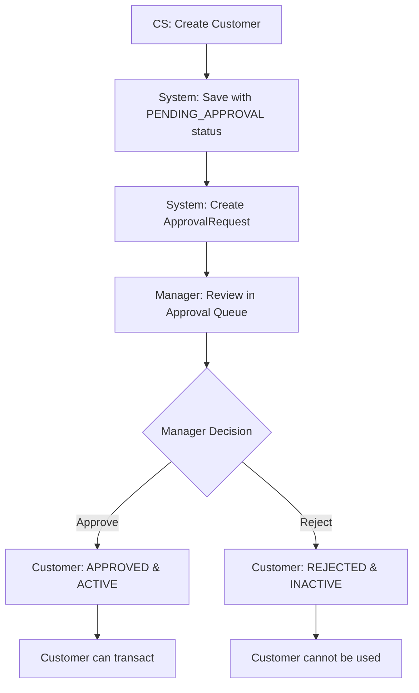

# Test Scenario: CS-S-001 - Customer Registration with Approval Workflow

## Scenario ID: CS-S-001
**Role**: Customer Service
**Type**: Success
**Module**: Customer Management + Approval Workflow
**Priority**: High

## Implementation Status
**Overall Status**: ✅ IMPLEMENTED (8/8 sub-scenarios)
**Test Classes**:
- `CustomerManagementFR002Test` - Customer creation with FR.002 compliant fields
- `ApprovalWorkflowSuccessTest` - Complete approval workflow scenarios
**Last Updated**: 2025-11-05

## 🆕 BREAKING CHANGE: Approval Workflow (Version 2.0)

**⚠️ IMPORTANT:** Starting from Version 2.0, all new customer registrations require approval from Branch Manager before the customer can be activated.

### What Changed:
- ✨ **NEW:** Customer created with status `PENDING_APPROVAL` (not immediately `ACTIVE`)
- ✨ **NEW:** ApprovalRequest automatically created for Branch Manager review
- ✨ **NEW:** Branch Manager must approve/reject before customer can transact
- ✨ **NEW:** Complete audit trail (requested_by, reviewed_by, review_notes, rejection_reason)
- ❌ **DEPRECATED:** Customers no longer automatically become ACTIVE after creation

### Approval Workflow Process:


## Overview

This document outlines comprehensive test scenarios for Customer Registration with Approval Workflow. The scenarios cover Personal and Corporate customer types with mandatory approval from Branch Manager.

## Test Data Sources

### Seed Data (Migration V002)
Pre-loaded customers available for testing (legacy data without approval workflow):

**Personal Customers:**
- C1000001: Ahmad Suharto (KTP: 3271081503850001)
- C1000002: Siti Nurhaliza (KTP: 3271082207900002)
- C1000004: Budi Santoso (KTP: 3271081011880003)
- C1000006: Dewi Lestari (KTP: 3271081805920004)

**Corporate Customers:**
- C1000003: PT. Teknologi Maju (Reg: 1234567890123456)

**Note:** Seed data customers have `approval_status = APPROVED` (legacy format).

## Test Scenarios

### 1. Customer Registration with Approval Workflow ✅ NEW

#### 1.1 Personal Customer Registration - Complete Approval Flow

**Test ID:** PC-REG-001-APPROVAL
**User Roles:** Customer Service (cs1, cs2, cs3) + Branch Manager (manager1, manager2)
**Test Class:** `ApprovalWorkflowSuccessTest.shouldCreateAndApprovePersonalCustomer()`

**Test Data:**
```
firstName: Approval
lastName: Testuser
identityNumber: 3201010101XXXXXX (unique per test)
identityType: KTP
email: approval{uniqueSuffix}@test.com
phoneNumber: 0812345{uniqueSuffix}
address: Jl. Approval Test No. 1
city: Jakarta
education: S1
religion: ISLAM
maritalStatus: KAWIN
dependents: 2
nationality: WNI
identityValidity: 2030-01-01
occupation: Test Engineer
company: PT Test
businessField: Technology
income: 10000000
purposeOfAccountOpening: Daily transactions
```

**Steps (Customer Service):**
1. Login as Customer Service (cs1)
2. Navigate to "Add Customer"
3. Select "Personal Customer"
4. Fill complete FR.002 compliant form
5. Click "Save"
6. **Expected:** Customer saved with:
   - `approval_status` = `PENDING_APPROVAL`
   - `status` = `INACTIVE`
   - ApprovalRequest created automatically
   - Success message: "submitted for approval"
7. Logout CS

**Steps (Branch Manager):**
8. Login as Branch Manager (manager1)
9. Navigate to "Approval Queue"
10. **Expected:** See pending approval request:
    - Request Type: CUSTOMER_CREATION
    - Entity Type: CUSTOMER
    - Requested By: customer-service
11. Click "View Details"
12. Review customer data
13. Fill review notes: "Approved for testing purposes"
14. Click "Approve"
15. **Expected:**
    - Customer `approval_status` = `APPROVED`
    - Customer `status` = `ACTIVE`
    - ApprovalRequest `approval_status` = `APPROVED`
    - Success message displayed
    - Redirected to approval queue
    - Pending count decreased by 1

**Verification:**
- Customer can now be used for account opening
- Customer visible in customer list with ACTIVE status
- Audit trail complete (requested_by, reviewed_by, review_notes, reviewed_date)

#### 1.2 Personal Customer Registration - Rejection Flow

**Test ID:** PC-REG-002-REJECTION
**Test Class:** `ApprovalWorkflowSuccessTest.shouldRejectCustomerCreationRequest()`

**Steps:**
1. CS creates customer (same as PC-REG-001-APPROVAL steps 1-7)
2. Manager logs in and navigates to approval queue
3. Manager clicks "View Details"
4. Manager fills rejection form:
   - Rejection Reason: "Incomplete documentation"
   - Review Notes: "Missing required documents"
5. Manager clicks "Reject"
6. **Expected:**
   - Customer `approval_status` = `REJECTED`
   - Customer `status` = `INACTIVE`
   - Customer cannot be used for transactions
   - Rejection reason saved for audit
   - CS can view rejection reason

### 2. Approval Queue Management ✅ NEW

#### 2.1 Filter Approval Queue by Request Type

**Test ID:** APPROVAL-FILTER-001
**Test Class:** `ApprovalWorkflowSuccessTest.shouldFilterApprovalQueueByRequestType()`

**Steps:**
1. Login as Branch Manager
2. Navigate to Approval Queue
3. Note total pending count
4. Select filter: "CUSTOMER_CREATION"
5. Click "Filter"
6. **Expected:** Only CUSTOMER_CREATION requests visible
7. Click "Clear"
8. **Expected:** All pending requests visible again

### 3. Database Schema Changes ✅ NEW

#### 3.1 Approval Status Fields

**New fields in `customers` table:**
```sql
approval_status VARCHAR(20) DEFAULT 'APPROVED'
  CHECK (approval_status IN ('PENDING_APPROVAL', 'APPROVED', 'REJECTED'))
```

**New table: `approval_requests`:**
```sql
CREATE TABLE approval_requests (
    id UUID PRIMARY KEY,
    request_type VARCHAR(50) NOT NULL CHECK (request_type IN ('CUSTOMER_CREATION', 'ACCOUNT_OPENING')),
    entity_type VARCHAR(20) NOT NULL CHECK (entity_type IN ('CUSTOMER', 'ACCOUNT')),
    entity_id UUID NOT NULL,
    approval_status VARCHAR(20) NOT NULL DEFAULT 'PENDING',
    requested_by VARCHAR(100) NOT NULL,
    request_notes TEXT,
    requested_date TIMESTAMP NOT NULL,
    reviewed_by VARCHAR(100),
    review_notes TEXT,
    reviewed_date TIMESTAMP,
    rejection_reason TEXT,
    branch_id UUID,
    created_date TIMESTAMP NOT NULL,
    updated_date TIMESTAMP NOT NULL
);
```

### 4. Legacy Test Compatibility

**For existing tests that expect immediate activation:**
- Tests using seed data (C1000001-C1000006) continue to work
- New tests must account for approval workflow
- Tests creating new customers must either:
  1. Include approval step (recommended)
  2. Directly set `approval_status = APPROVED` in test setup (for unit tests)

## Test Coverage Summary

| Feature | Unit Tests | Integration Tests | Functional Tests | API Tests |
|---------|------------|-------------------|----------------|-----------|
| Customer Creation with Approval | ✓ | ✓ | ✓ | Pending |
| Approval Workflow | ✓ | ✓ | ✓ | Pending |
| Customer Rejection | ✓ | ✓ | ✓ | Pending |
| Approval Queue | ✓ | ✓ | ✓ | Pending |
| Legacy Customer CRUD | ✓ | ✓ | ✓ | ✓ |

## Migration Notes

### For Developers:
1. Update all customer creation tests to handle `PENDING_APPROVAL` status
2. Add approval step for tests that need active customers
3. Use `CustomerManagementFR002Test` as reference for FR.002 compliance
4. Use `ApprovalWorkflowSuccessTest` as reference for approval flow

### For Testers:
1. All new customers require Branch Manager approval
2. Check "Approval Queue" menu for pending requests
3. Provide clear review notes when approving/rejecting
4. Rejection requires mandatory rejection reason

### For Documentation:
1. Old documentation showing direct activation is obsolete
2. New user manual: `docs/user-manual/panduan-approval-workflow.md`
3. All screenshots updated to show approval workflow
4. GitHub Pages documentation automatically updated

## Related Documentation

- 📚 **User Manual:** [Panduan Approval Workflow](../../user-manual/panduan-approval-workflow.md)
- 🔧 **Technical:** [Database Schema V006](../../database-documentation.md#v006-approval-workflow)
- 🧪 **Test Code:** `ApprovalWorkflowSuccessTest.java`, `CustomerManagementFR002Test.java`
- 🏛️ **Architecture:** [Approval Workflow Design](../../technical-practices/04-architectural-patterns.md)

---

*Last Updated: 05 November 2025 - Added Approval Workflow (Version 2.0)*
