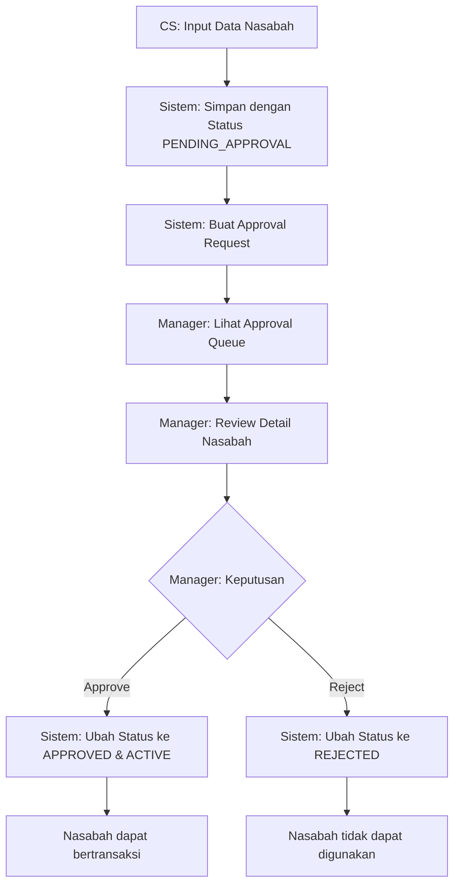

# Panduan Approval Workflow untuk Branch Manager

**Aplikasi Minibank - Sistem Perbankan Syariah**

---

**Tanggal Pembuatan:** 05 November 2025  
**Versi:** 2.0  
**Target Pengguna:** Customer Service (CS) dan Branch Manager  
**Status:** Aktif  

---

## Daftar Isi

1. [Gambaran Umum](#gambaran-umum)
2. [Prasyarat](#prasyarat)
3. [Alur Kerja Approval](#alur-kerja-approval)
4. [Langkah-langkah Detail](#langkah-langkah-detail)
   1. [Bagian 1: Customer Service - Membuat Nasabah Baru](#bagian-1-customer-service---membuat-nasabah-baru)
   2. [Bagian 2: Branch Manager - Review dan Approval](#bagian-2-branch-manager---review-dan-approval)
5. [Video Tutorial](#video-tutorial)
6. [Status Approval](#status-approval)
7. [Tips dan Catatan Penting](#tips-dan-catatan-penting)
8. [Pemecahan Masalah Umum](#pemecahan-masalah-umum)

---

## Gambaran Umum

Panduan ini menjelaskan proses **Approval Workflow** dalam sistem Minibank. Approval Workflow adalah mekanisme kontrol yang memastikan setiap nasabah baru yang didaftarkan oleh Customer Service harus disetujui terlebih dahulu oleh Branch Manager sebelum dapat melakukan transaksi.

**Manfaat Approval Workflow:**
- ✅ Kontrol kualitas data nasabah
- ✅ Pencegahan fraud dan data tidak valid
- ✅ Audit trail lengkap untuk setiap persetujuan
- ✅ Dual control untuk operasi penting

**Waktu Estimasi:** 10-15 menit per approval request

---

## Prasyarat

### Untuk Customer Service:
1. **Akses Sistem**
   - Username dan password CS yang valid
   - Koneksi internet stabil
   - Browser web yang didukung (Chrome, Firefox, Safari)

2. **Dokumen Nasabah**
   - KTP/Passport asli dan fotokopi
   - NPWP (jika ada)
   - Dokumen pendukung sesuai kebijakan bank

### Untuk Branch Manager:
1. **Akses Sistem**
   - Username dan password Branch Manager yang valid
   - Authority untuk melakukan approval

2. **Tanggung Jawab**
   - Memverifikasi kelengkapan data nasabah
   - Memastikan kepatuhan terhadap regulasi
   - Memberikan catatan review yang jelas

---

## Alur Kerja Approval

---

## Langkah-langkah Detail

### Bagian 1: Customer Service - Membuat Nasabah Baru

#### Langkah 1: Login sebagai Customer Service

**Detail Langkah:**
1. Buka halaman login aplikasi Minibank
2. Masukkan username CS Anda (contoh: cs1)
3. Masukkan password yang telah ditentukan
4. Klik tombol "Login"
5. Verifikasi bahwa Anda berhasil masuk ke dashboard

---

#### Langkah 2: Navigasi ke Menu Customer Management

**Detail Langkah:**
1. Dari dashboard, cari menu navigasi di sidebar
2. Klik menu "Customer Management"
3. Klik tombol "Add Customer" atau "Tambah Nasabah"
4. Sistem menampilkan pilihan jenis nasabah

---

#### Langkah 3: Pilih Jenis Nasabah dan Isi Form

**Detail Langkah:**
1. Pilih "Personal Customer"
2. Isi semua field yang wajib (ditandai dengan *)
3. **Data Pribadi:**
   - Nama Depan dan Nama Belakang
   - Nomor Identitas (KTP/Passport)
   - Tanggal Lahir dan Tempat Lahir
   - Jenis Kelamin
   - Nama Ibu Kandung
4. **Data Kontak:**
   - Email (opsional)
   - Nomor Telepon
   - Alamat Lengkap
   - Kota dan Kode Pos
5. **Data Pekerjaan (FR.002):**
   - Pekerjaan dan Perusahaan
   - Bidang Usaha
   - Penghasilan Rata-rata
   - Tujuan Pembukaan Rekening
6. Periksa kembali semua data yang diisi

---

#### Langkah 4: Simpan Nasabah (Pending Approval)

**Detail Langkah:**
1. Klik tombol "Simpan" atau "Save"
2. Tunggu proses penyimpanan selesai
3. Sistem menampilkan pesan sukses
4. **Penting:** Nasabah tersimpan dengan status **PENDING_APPROVAL**
5. Nasabah belum dapat melakukan transaksi
6. Approval request otomatis dibuat untuk Branch Manager

> **💡 Catatan:** Pesan sukses akan menyebutkan bahwa nasabah "submitted for approval" atau "menunggu persetujuan".

---

#### Langkah 5: Logout Customer Service

**Detail Langkah:**
1. Klik menu user di pojok kanan atas
2. Pilih "Logout"
3. Sistem kembali ke halaman login

---

### Bagian 2: Branch Manager - Review dan Approval

#### Langkah 6: Login sebagai Branch Manager

**Detail Langkah:**
1. Buka halaman login aplikasi Minibank
2. Masukkan username Branch Manager (contoh: manager1)
3. Masukkan password Branch Manager
4. Klik tombol "Login"
5. Verifikasi berhasil masuk ke dashboard Branch Manager

---

#### Langkah 7: Navigasi ke Approval Queue

**Detail Langkah:**
1. Dari dashboard, cari menu "Approval Queue" di sidebar
2. Klik menu "Approval Queue"
3. Sistem menampilkan daftar approval yang pending
4. Badge "X Pending" menunjukkan jumlah approval yang menunggu
5. Tabel menampilkan:
   - Request Type (CUSTOMER_CREATION, ACCOUNT_OPENING)
   - Entity Type (CUSTOMER, ACCOUNT)
   - Requested By (nama CS yang membuat)
   - Requested Date (tanggal pembuatan)
   - Request Notes (catatan dari CS)

---

#### Langkah 8: Lihat Detail Approval Request

**Detail Langkah:**
1. Klik link "View Details" pada approval request yang akan direview
2. Sistem menampilkan halaman detail approval
3. **Informasi Request:**
   - Request Type: CUSTOMER_CREATION
   - Entity Type: CUSTOMER
   - Requested By: customer-service
   - Requested Date: tanggal dan waktu pembuatan
   - Request Notes: catatan dari CS
4. **Detail Data Nasabah:**
   - Customer Number (auto-generated)
   - Customer Type (PERSONAL/CORPORATE)
   - Nama Lengkap
   - Email dan Nomor Telepon
   - Alamat Lengkap
   - Semua data FR.002 lainnya
5. **Form Approval Actions:**
   - Form Approve (hijau): untuk menyetujui
   - Form Reject (merah): untuk menolak

---

#### Langkah 9: Approve atau Reject Request

##### Opsi A: Approve Request

**Detail Langkah untuk Approve:**
1. Periksa semua data nasabah dengan teliti
2. Pastikan data sesuai dengan dokumen
3. Pastikan tidak ada red flag atau data mencurigakan
4. Isi field "Review Notes" (opsional) dengan catatan review Anda
   - Contoh: "Data nasabah lengkap dan sesuai dokumen. Disetujui untuk aktivasi."
5. Klik tombol "Approve" (hijau)
6. Sistem memproses approval
7. **Hasil:**
   - Approval status berubah menjadi **APPROVED**
   - Customer status berubah menjadi **ACTIVE**
   - Nasabah dapat melakukan transaksi
   - Reviewed By: diisi dengan username Branch Manager
   - Reviewed Date: diisi dengan tanggal/waktu approval
8. Sistem menampilkan pesan sukses
9. Otomatis redirect ke Approval Queue

##### Opsi B: Reject Request

**Detail Langkah untuk Reject:**
1. Jika menemukan data tidak valid atau mencurigakan
2. Scroll ke form "Reject Request" (merah)
3. **Wajib** isi field "Rejection Reason" dengan alasan penolakan
   - Contoh: "Dokumen identitas tidak sesuai dengan data yang diinput"
   - Contoh: "Data pekerjaan tidak lengkap dan tidak jelas"
   - Contoh: "Nomor telepon tidak dapat dihubungi"
4. Isi field "Additional Notes" (opsional) dengan catatan tambahan
5. Klik tombol "Reject" (merah)
6. **Hasil:**
   - Approval status berubah menjadi **REJECTED**
   - Customer tetap dengan status **INACTIVE**
   - Nasabah tidak dapat melakukan transaksi
   - Rejection reason tersimpan untuk audit
   - CS dapat melihat alasan penolakan

---

#### Langkah 10: Verifikasi Approval Queue

**Detail Langkah:**
1. Setelah approve/reject, sistem redirect ke Approval Queue
2. Badge "Pending" akan berkurang 1
3. Approval request yang sudah diproses tidak tampil lagi di queue
4. Request berikutnya (jika ada) dapat diproses

---

## Video Tutorial

Berikut adalah video tutorial yang menunjukkan seluruh proses approval workflow:

### Tutorial Approval Workflow doc complete approval workflow tutorial

**File:** [2025-11-05_20-54-03_approvalworkflowtutorialtest_doc_complete_approval_workflow_tutorial.webm](videos/2025-11-05_20-54-03_approvalworkflowtutorialtest_doc_complete_approval_workflow_tutorial.webm)

> **Catatan:** Untuk memutar video, klik link di atas atau buka file langsung menggunakan browser yang mendukung format WebM.

---

## Status Approval

### Status Approval Request

| Status | Deskripsi | Aksi yang Tersedia |
|--------|-----------|--------------------|
| **PENDING** | Request menunggu review dari Branch Manager | Approve / Reject |
| **APPROVED** | Request telah disetujui, entity menjadi ACTIVE | Tidak ada (readonly) |
| **REJECTED** | Request ditolak, entity tetap INACTIVE | Tidak ada (readonly) |

### Status Customer

| Approval Status | Customer Status | Dapat Bertransaksi? | Keterangan |
|-----------------|-----------------|---------------------|------------|
| PENDING_APPROVAL | INACTIVE | ❌ Tidak | Menunggu approval dari Branch Manager |
| APPROVED | ACTIVE | ✅ Ya | Customer aktif dan dapat bertransaksi |
| REJECTED | INACTIVE | ❌ Tidak | Customer ditolak, tidak dapat digunakan |

---

## Tips dan Catatan Penting

### Tips untuk Customer Service:

1. **Kelengkapan Data**
   - Pastikan semua field wajib terisi dengan benar
   - Verifikasi data dengan dokumen asli
   - Gunakan data yang jelas dan akurat

2. **Request Notes**
   - Berikan catatan jika ada hal khusus yang perlu diperhatikan
   - Sebutkan jenis dokumen yang telah diverifikasi
   - Informasikan tujuan pembukaan rekening

3. **Follow Up**
   - Informasikan kepada nasabah bahwa rekening perlu approval
   - Estimasi waktu approval: 1-2 hari kerja
   - Jika reject, koordinasi dengan Manager untuk perbaikan data

### Tips untuk Branch Manager:

1. **Review yang Teliti**
   - Periksa kelengkapan dan keakuratan data
   - Verifikasi kesesuaian dengan regulasi banking
   - Perhatikan red flag: data tidak konsisten, nomor tidak valid, dll

2. **Review Notes yang Jelas**
   - Berikan catatan review yang spesifik
   - Untuk rejection, jelaskan alasan dengan detail
   - Review notes akan menjadi audit trail

3. **SLA Approval**
   - Usahakan approve/reject dalam 1 hari kerja
   - Prioritaskan request yang urgent
   - Koordinasi dengan CS jika ada data yang perlu dikonfirmasi

### Keamanan:

- 🔒 Jangan share password dengan siapapun
- 🔒 Selalu logout setelah selesai
- 🔒 Laporkan aktivitas mencurigakan kepada IT Security
- 🔒 Approval decision tidak dapat diubah setelah diproses

---

## Pemecahan Masalah Umum

### Masalah Customer Service:

**1. Form tidak bisa disimpan**
   - Pastikan semua field wajib (*) sudah terisi
   - Periksa format email (harus valid)
   - Periksa format nomor telepon
   - Pastikan nomor identitas belum terdaftar

**2. Tidak tahu status approval**
   - Lihat customer list, cek kolom "Approval Status"
   - Status PENDING_APPROVAL: masih menunggu manager
   - Status APPROVED: sudah disetujui
   - Status REJECTED: ditolak, lihat rejection reason

### Masalah Branch Manager:

**1. Approval Queue kosong**
   - Refresh halaman (F5)
   - Periksa filter jika ada
   - Mungkin memang tidak ada pending request

**2. Tidak bisa approve/reject**
   - Pastikan login sebagai Branch Manager
   - Periksa authority/permission Anda
   - Untuk reject, wajib isi rejection reason
   - Refresh halaman jika tombol tidak responsif

**3. Error saat approve**
   - Periksa koneksi internet
   - Coba refresh dan ulangi
   - Hubungi IT jika error berlanjut

### Kontak Dukungan:

- 📞 IT Help Desk: ext. 123
- 📞 Supervisor CS: ext. 456
- 📞 Manager Operasional: ext. 789

---

## Informasi Dokumen

**Dibuat oleh:** Sistem Aplikasi Minibank  
**Tanggal:** 05 November 2025  
**Versi:** 2.0  
**Format:** Markdown (.md)  

**Hak Cipta:** © 2025 Aplikasi Minibank - Sistem Perbankan Syariah  

---

*Panduan ini dibuat secara otomatis menggunakan Playwright Test Framework dan Java. Untuk pembaruan atau perbaikan, hubungi tim IT atau maintainer sistem.*

**Generator:** ApprovalWorkflowDocGenerator.java  
**Test Source:** ApprovalWorkflowTutorialTest.java  
**Framework:** Playwright + Java  
