# Panduan Proses Onboarding Nasabah Baru

**Aplikasi Minibank - Sistem Perbankan Syariah**

---

**Tanggal Pembuatan:** 05 November 2025  
**Versi:** 3.0  
**Target Pengguna:** Customer Service (CS), Branch Manager, dan Teller  
**Status:** Aktif  

---

## Daftar Isi

1. [Gambaran Umum](#gambaran-umum)
2. [Proses Bisnis End-to-End](#proses-bisnis-end-to-end)
   1. [Customer Service: Registrasi Nasabah & Pembukaan Rekening](#customer-service-registrasi-nasabah--pembukaan-rekening)
   2. [Branch Manager: Persetujuan Nasabah & Rekening](#branch-manager-persetujuan-nasabah--rekening)
   3. [Teller: Transaksi & Layanan](#teller-transaksi--layanan)
3. [Prasyarat](#prasyarat)
4. [Alur Kerja Approval](#alur-kerja-approval)
5. [Langkah-langkah Detail](#langkah-langkah-detail)
   1. [Bagian 1: Customer Service - Membuat Nasabah Baru](#bagian-1-customer-service---membuat-nasabah-baru)
   2. [Bagian 2: Branch Manager - Review dan Approval](#bagian-2-branch-manager---review-dan-approval)
6. [Video Tutorial](#video-tutorial)
7. [Status Approval](#status-approval)
8. [Tips dan Catatan Penting](#tips-dan-catatan-penting)
9. [Pemecahan Masalah Umum](#pemecahan-masalah-umum)

---

## Gambaran Umum

Panduan ini menjelaskan proses **Approval Workflow** dalam sistem Minibank. Approval Workflow adalah mekanisme kontrol yang memastikan setiap nasabah baru yang didaftarkan oleh Customer Service harus disetujui terlebih dahulu oleh Branch Manager sebelum dapat melakukan transaksi.

**Manfaat Approval Workflow:**
- ✅ Kontrol kualitas data nasabah
- ✅ Pencegahan fraud dan data tidak valid
- ✅ Audit trail lengkap untuk setiap persetujuan
- ✅ Dual control untuk operasi penting

**Waktu Estimasi:** 10-15 menit per approval request

---

## Proses Bisnis End-to-End

Panduan ini menjelaskan alur bisnis lengkap dari pendaftaran nasabah hingga transaksi pertama. Sistem Minibank menggunakan **dual approval workflow** untuk memastikan keamanan dan akurasi data.

### Customer Service: Registrasi Nasabah & Pembukaan Rekening

#### 1. Pilih Jenis Nasabah
Customer Service memulai dengan memilih jenis nasabah:
- **Personal Customer (Nasabah Perorangan)**
  - Untuk individu
  - Memerlukan KTP/Passport
  - Data personal lengkap (FR.002)
- **Corporate Customer (Nasabah Korporat)**
  - Untuk perusahaan/badan hukum
  - Memerlukan dokumen perusahaan
  - Informasi PIC (Person In Charge)

#### 2. Input Data Nasabah
CS mengisi formulir lengkap dengan data yang diverifikasi dari dokumen:
- **Identitas:** KTP/Passport, tanggal lahir, tempat lahir
- **Kontak:** Email, nomor telepon, alamat lengkap
- **Data Pribadi:** Pendidikan, agama, status pernikahan, tanggungan
- **Pekerjaan:** Occupation, perusahaan, bidang usaha, penghasilan
- **Tujuan:** Purpose of account opening, estimasi transaksi
- **Compliance:** Source of funds (anti money laundering)

#### 3. Simpan Data & Dapatkan Customer Number
Setelah data divalidasi:
- Sistem generate **Customer Number** otomatis (contoh: C1000001)
- Status nasabah: **PENDING_APPROVAL** (INACTIVE)
- Sistem membuat **ApprovalRequest** otomatis untuk Branch Manager
- CS mendapat konfirmasi: "Customer submitted for approval"

#### 4. Buka Layar Account Opening
CS melanjutkan dengan membuka rekening untuk nasabah:
- Navigate ke menu "Open Account"
- Sistem menampilkan form pencarian customer

#### 5. Cari & Pilih Nasabah
CS dapat mencari nasabah dengan berbagai cara:
- **Search by Customer Number:** Ketik nomor nasabah (C1000001)
- **Search by Name:** Ketik nama lengkap atau sebagian nama
- **Search by Email:** Ketik alamat email
- Sistem menampilkan hanya nasabah dengan status **ACTIVE**
- ⚠️ **Catatan:** Nasabah PENDING_APPROVAL tidak dapat dibuka rekeningnya

#### 6. Pilih Jenis Rekening (Account Type)
Sistem menampilkan produk yang tersedia berdasarkan jenis nasabah:
- **Conventional Products:**
  - SAVINGS (Tabungan konvensional)
  - CHECKING (Giro konvensional)
- **Islamic Banking Products:**
  - TABUNGAN_WADIAH (Tabungan Syariah dengan akad Wadiah)
  - TABUNGAN_MUDHARABAH (Tabungan Syariah dengan akad Mudharabah)
  - DEPOSITO_MUDHARABAH (Deposito Syariah)

#### 7. Pilih Akad Syariah (Islamic Contract)
Akad sudah embedded dalam product type:
- **Wadiah (Safekeeping)**
  - Produk: TABUNGAN_WADIAH
  - Prinsip: Titipan dengan izin penggunaan
  - Bonus: Bank boleh memberikan bonus (tidak dijanjikan)
  - Cocok untuk: Transaction account, liquidity management
- **Mudharabah (Profit Sharing)**
  - Produk: TABUNGAN_MUDHARABAH, DEPOSITO_MUDHARABAH
  - Prinsip: Bagi hasil (profit sharing)
  - Nisbah: Customer 60% - Bank 40% (configurable)
  - Cocok untuk: Savings account, investment
- **Qardh (Benevolent Loan)** - Coming soon

#### 8. Simpan Rekening Baru
CS melengkapi form pembukaan rekening:
- **Account Name:** Nama untuk rekening (e.g., "John - Savings")
- **Product:** Pilihan produk Islamic/conventional
- Sistem generate **Account Number** otomatis (contoh: ACC0000001)
- Status rekening: **PENDING_APPROVAL** (INACTIVE)
- Sistem membuat **ApprovalRequest** otomatis untuk Branch Manager
- **Catatan:** Rekening dibuat dengan saldo nol, setoran awal dilakukan di menu Teller setelah approval

**Summary CS Flow:**
```
CS Login → Select Customer Type → Input Data → Save (get C1000001)
       → Open Account → Search Customer → Select Product & Akad
       → Save Account (get ACC0000001)
       → Both waiting for Branch Manager approval
       → Setoran awal dilakukan Teller setelah approval
```

---

### Branch Manager: Persetujuan Nasabah & Rekening

#### 1. Cari Nasabah (Search Customer)
Branch Manager login dan navigate ke **Approval Queue**:
- Queue menampilkan semua pending approval
- Filter by **Request Type:**
  - CUSTOMER_CREATION: Nasabah baru
  - ACCOUNT_OPENING: Rekening baru
- Filter by **Entity Type:**
  - CUSTOMER
  - ACCOUNT
- Search by customer number, name, atau requested date

#### 2. Temukan Data Nasabah Baru
Manager klik "View Details" pada request **CUSTOMER_CREATION**:
- **Request Information:**
  - Request Type: CUSTOMER_CREATION
  - Entity Type: CUSTOMER
  - Requested By: CS username (e.g., cs1)
  - Requested Date: Timestamp pembuatan
  - Request Notes: Catatan dari CS
- **Customer Details (Complete):**
  - Customer Number: C1000001
  - Customer Type: PERSONAL/CORPORATE
  - Personal data: nama, identitas, kontak
  - Employment data: pekerjaan, penghasilan
  - Compliance data: source of funds, account purpose
  - All FR.002 compliant fields

#### 3. Authorize Customer Registration
Manager melakukan review dan approval:
- **Review Checklist:**
  - ✅ Data lengkap dan akurat
  - ✅ Sesuai dengan dokumen pendukung
  - ✅ Tidak ada red flag (data mencurigakan)
  - ✅ Compliant dengan regulasi banking
- **Action: Approve**
  - Isi "Review Notes" (optional but recommended)
  - Klik tombol "Approve"
  - Hasil: Customer status → **APPROVED & ACTIVE**
  - Customer dapat digunakan untuk account opening
- **Action: Reject**
  - **Wajib** isi "Rejection Reason" dengan detail
  - Isi "Additional Notes" (optional)
  - Klik tombol "Reject"
  - Hasil: Customer status → **REJECTED & INACTIVE**
  - CS dapat melihat rejection reason untuk perbaikan

#### 4. Cari Rekening by Customer (Search Account)
Setelah approve customer, Manager mencari account request:
- Kembali ke **Approval Queue**
- Filter by Request Type: **ACCOUNT_OPENING**
- Dapat search by customer number atau account number
- Sistem menampilkan accounts yang pending approval

#### 5. Temukan Rekening Baru untuk Nasabah
Manager klik "View Details" pada request **ACCOUNT_OPENING**:
- **Request Information:**
  - Request Type: ACCOUNT_OPENING
  - Entity Type: ACCOUNT
  - Requested By: CS username
  - Request Notes: e.g., "New account opening for [Customer Name]"
- **Account Details:**
  - Account Number: ACC0000001
  - Account Name: As per CS input
  - Customer: Link to customer (C1000001)
  - Product: Product name, type, category
  - Product Type: TABUNGAN_WADIAH, TABUNGAN_MUDHARABAH, etc.
  - Balance: IDR 0 (setoran awal dilakukan di Teller)
  - Currency: IDR
  - Status: PENDING_APPROVAL

#### 6. Authorize Account Opening
Manager melakukan review dan approval rekening:
- **Review Checklist:**
  - ✅ Customer sudah APPROVED & ACTIVE
  - ✅ Product sesuai dengan customer type
  - ✅ Account name dan details sesuai
- **Action: Approve**
  - Isi "Review Notes"
  - Klik tombol "Approve"
  - Hasil: Account status → **APPROVED & ACTIVE**
  - Nasabah dapat mulai bertransaksi
- **Action: Reject**
  - **Wajib** isi "Rejection Reason"
  - Hasil: Account status → **REJECTED & INACTIVE**
  - Rekening tidak dapat digunakan

**Summary Manager Flow:**
```
Manager Login → Approval Queue
             → Search & Filter (CUSTOMER_CREATION)
             → View Details Customer (C1000001)
             → Approve/Reject Customer
             → Search & Filter (ACCOUNT_OPENING)
             → View Details Account (ACC0000001)
             → Approve/Reject Account
             → Customer & Account now ACTIVE
```

---

### Teller: Transaksi & Layanan

Setelah customer dan account diapprove, Teller dapat melayani transaksi.

> **💡 Catatan Penting:** Setoran awal (initial deposit) dilakukan di menu Teller setelah rekening diapprove oleh Branch Manager. Rekening dibuat dengan saldo nol oleh Customer Service.

#### 1. Cari Nasabah untuk Transaksi
Teller login dan navigate ke menu transaksi:
- **Menu:** Cash Deposit / Cash Withdrawal / Transfer
- **Search Account:**
  - By Account Number: ACC0000001
  - By Account Name: Sebagian nama
  - By Customer Number: C1000001
- Sistem hanya menampilkan accounts dengan status **ACTIVE**
- Sistem validasi approval_status = **APPROVED**

#### 2. Input Transaksi Cash Deposit (Setoran Tunai)
Teller memproses setoran tunai:
- **Form Transaction:**
  - Account: Selected account (auto-filled)
  - Amount: Jumlah setoran (IDR)
  - Description: "Setoran Tunai" atau custom
  - Reference Number: Optional transaction reference
  - Channel: TELLER (auto-filled)
  - Created By: Teller username
- **Process:**
  - Sistem generate Transaction Number (e.g., TXN0000001)
  - Record balance before and after
  - Update account balance using `account.deposit(amount)`
  - Create audit trail dengan timestamp
  - Display success message dengan transaction number

#### 3. Print Account Statement (Rekening Koran) ke PDF
Teller dapat generate dan print rekening koran:
- **Navigate:** Account List → Select Account → "Statement"
- **Form Parameters:**
  - Start Date: Tanggal awal periode (default: 3 bulan lalu)
  - End Date: Tanggal akhir periode (default: hari ini)
- **Klik:** "Generate PDF"
- **Output PDF Content:**
  - Bank letterhead dan logo
  - Account information (number, name, type, product)
  - Customer information
  - Statement period
  - Transaction table:
    - Date | Description | Transaction Type
    - Debit | Credit | Running Balance
  - Opening balance dan closing balance
  - Total debit dan total credit
  - Generated timestamp dan user
- **Download:** File format: `statement_ACC0000001_2025-01-01_to_2025-03-31.pdf`

**Bonus: Transaction Receipt PDF**
Setiap transaksi juga dapat di-print sebagai receipt:
- Navigate ke Transaction List
- Klik "View" pada transaction
- Klik "Download Receipt (PDF)"
- Professional receipt format dengan transaction details lengkap

**Summary Teller Flow:**
```
Teller Login → Cash Deposit Menu
            → Search Account (by number/name/customer)
            → Select ACTIVE Account (ACC0000001)
            → Input Amount & Details
            → Process Transaction (get TXN0000001)
            → Print Receipt PDF (optional)
            → OR Generate Account Statement PDF
```

---

### 🎯 Complete Business Flow Summary

```mermaid
sequenceDiagram
    participant CS as Customer Service
    participant System
    participant Manager as Branch Manager
    participant Teller
    
    Note over CS: Part 1: Customer & Account Creation
    CS->>System: 1. Select Customer Type (Personal/Corporate)
    CS->>System: 2. Input Customer Details (FR.002)
    System->>System: 3. Generate Customer Number (C1000001)
    System->>System: Save with PENDING_APPROVAL status
    CS->>System: 4. Navigate to Account Opening
    CS->>System: 5. Search & Select Customer
    CS->>System: 6. Select Account Type (SAVINGS/CHECKING)
    CS->>System: 7. Select Akad (WADIAH/MUDHARABAH)
    System->>System: 8. Generate Account Number (ACC0000001)
    System->>System: Save with PENDING_APPROVAL status
    
    Note over Manager: Part 2: Approval Process
    Manager->>System: 1. Search Customer in Approval Queue
    System->>Manager: 2. Display Customer Details (C1000001)
    Manager->>System: 3. Approve Customer Registration
    System->>System: Customer → APPROVED & ACTIVE
    Manager->>System: 4. Search Account in Approval Queue
    System->>Manager: 5. Display Account Details (ACC0000001)
    Manager->>System: 6. Approve Account Opening
    System->>System: Account → APPROVED & ACTIVE
    
    Note over Teller: Part 3: Transaction Processing
    Teller->>System: 1. Search Customer/Account
    System->>Teller: Display ACTIVE Accounts only
    Teller->>System: 2. Input Cash Deposit Transaction
    System->>System: Generate Transaction Number (TXN0000001)
    System->>System: Update Balance & Create Audit Trail
    Teller->>System: 3. Generate Account Statement PDF
    System->>Teller: Download statement_ACC0000001.pdf
```



**🔑 Key Points:**
1. **Customer Number** auto-generated saat CS save customer (C1000001)
2. **Account Number** auto-generated saat CS save account (ACC0000001)
3. **Akad Selection** embedded dalam product type (TABUNGAN_WADIAH = Wadiah akad)
4. **Dual Approval** required: Customer approval → then Account approval
5. **Status Flow:**
   - Customer: PENDING_APPROVAL → APPROVED → ACTIVE (can transact)
   - Account: PENDING_APPROVAL → APPROVED → ACTIVE (can transact)
6. **Complete Audit Trail** for all operations with timestamp and username

---

## Prasyarat

### Untuk Customer Service:
1. **Akses Sistem**
   - Username dan password CS yang valid
   - Koneksi internet stabil
   - Browser web yang didukung (Chrome, Firefox, Safari)

2. **Dokumen Nasabah**
   - KTP/Passport asli dan fotokopi
   - NPWP (jika ada)
   - Dokumen pendukung sesuai kebijakan bank

### Untuk Branch Manager:
1. **Akses Sistem**
   - Username dan password Branch Manager yang valid
   - Authority untuk melakukan approval

2. **Tanggung Jawab**
   - Memverifikasi kelengkapan data nasabah
   - Memastikan kepatuhan terhadap regulasi
   - Memberikan catatan review yang jelas

---

## Alur Kerja Approval


---

## Langkah-langkah Detail

### Bagian 1: Customer Service - Membuat Nasabah Baru

#### Langkah 1: Login sebagai Customer Service


**Detail Langkah:**
1. Buka halaman login aplikasi Minibank
2. Masukkan username CS Anda (contoh: cs1)
3. Masukkan password yang telah ditentukan
4. Klik tombol "Login"
5. Verifikasi bahwa Anda berhasil masuk ke dashboard


---

#### Langkah 2: Navigasi ke Menu Customer Management


**Detail Langkah:**
1. Dari dashboard, cari menu navigasi di sidebar
2. Klik menu "Customer Management"
3. Klik tombol "Add Customer" atau "Tambah Nasabah"
4. Sistem menampilkan pilihan jenis nasabah

---

#### Langkah 3: Pilih Jenis Nasabah dan Isi Form


**Detail Langkah:**
1. Pilih "Personal Customer"
2. Isi semua field yang wajib (ditandai dengan *)
3. **Data Pribadi:**
   - Nama Depan dan Nama Belakang
   - Nomor Identitas (KTP/Passport)
   - Tanggal Lahir dan Tempat Lahir
   - Jenis Kelamin
   - Nama Ibu Kandung
4. **Data Kontak:**
   - Email (opsional)
   - Nomor Telepon
   - Alamat Lengkap
   - Kota dan Kode Pos
5. **Data Pekerjaan (FR.002):**
   - Pekerjaan dan Perusahaan
   - Bidang Usaha
   - Penghasilan Rata-rata
   - Tujuan Pembukaan Rekening
6. Periksa kembali semua data yang diisi

---

#### Langkah 4: Simpan Nasabah (Pending Approval)


**Detail Langkah:**
1. Klik tombol "Simpan" atau "Save"
2. Tunggu proses penyimpanan selesai
3. Sistem menampilkan pesan sukses
4. **Penting:** Nasabah tersimpan dengan status **PENDING_APPROVAL**
5. Nasabah belum dapat melakukan transaksi
6. Approval request otomatis dibuat untuk Branch Manager

> **💡 Catatan:** Pesan sukses akan menyebutkan bahwa nasabah "submitted for approval" atau "menunggu persetujuan".

---

#### Langkah 5: Logout Customer Service


**Detail Langkah:**
1. Klik menu user di pojok kanan atas
2. Pilih "Logout"
3. Sistem kembali ke halaman login

---

### Bagian 2: Branch Manager - Review dan Approval

#### Langkah 6: Login sebagai Branch Manager


**Detail Langkah:**
1. Buka halaman login aplikasi Minibank
2. Masukkan username Branch Manager (contoh: manager1)
3. Masukkan password Branch Manager
4. Klik tombol "Login"
5. Verifikasi berhasil masuk ke dashboard Branch Manager

---

#### Langkah 7: Navigasi ke Approval Queue


**Detail Langkah:**
1. Dari dashboard, cari menu "Approval Queue" di sidebar
2. Klik menu "Approval Queue"
3. Sistem menampilkan daftar approval yang pending
4. Badge "X Pending" menunjukkan jumlah approval yang menunggu
5. Tabel menampilkan:
   - Request Type (CUSTOMER_CREATION, ACCOUNT_OPENING)
   - Entity Type (CUSTOMER, ACCOUNT)
   - Requested By (nama CS yang membuat)
   - Requested Date (tanggal pembuatan)
   - Request Notes (catatan dari CS)

---

#### Langkah 8: Lihat Detail Approval Request


**Detail Langkah:**
1. Klik link "View Details" pada approval request yang akan direview
2. Sistem menampilkan halaman detail approval
3. **Informasi Request:**
   - Request Type: CUSTOMER_CREATION
   - Entity Type: CUSTOMER
   - Requested By: customer-service
   - Requested Date: tanggal dan waktu pembuatan
   - Request Notes: catatan dari CS
4. **Detail Data Nasabah:**
   - Customer Number (auto-generated)
   - Customer Type (PERSONAL/CORPORATE)
   - Nama Lengkap
   - Email dan Nomor Telepon
   - Alamat Lengkap
   - Semua data FR.002 lainnya
5. **Form Approval Actions:**
   - Form Approve (hijau): untuk menyetujui
   - Form Reject (merah): untuk menolak

---

#### Langkah 9: Approve atau Reject Request

##### Opsi A: Approve Request


**Detail Langkah untuk Approve:**
1. Periksa semua data nasabah dengan teliti
2. Pastikan data sesuai dengan dokumen
3. Pastikan tidak ada red flag atau data mencurigakan
4. Isi field "Review Notes" (opsional) dengan catatan review Anda
   - Contoh: "Data nasabah lengkap dan sesuai dokumen. Disetujui untuk aktivasi."
5. Klik tombol "Approve" (hijau)
6. Sistem memproses approval
7. **Hasil:**
   - Approval status berubah menjadi **APPROVED**
   - Customer status berubah menjadi **ACTIVE**
   - Nasabah dapat melakukan transaksi
   - Reviewed By: diisi dengan username Branch Manager
   - Reviewed Date: diisi dengan tanggal/waktu approval
8. Sistem menampilkan pesan sukses
9. Otomatis redirect ke Approval Queue

##### Opsi B: Reject Request

**Detail Langkah untuk Reject:**
1. Jika menemukan data tidak valid atau mencurigakan
2. Scroll ke form "Reject Request" (merah)
3. **Wajib** isi field "Rejection Reason" dengan alasan penolakan
   - Contoh: "Dokumen identitas tidak sesuai dengan data yang diinput"
   - Contoh: "Data pekerjaan tidak lengkap dan tidak jelas"
   - Contoh: "Nomor telepon tidak dapat dihubungi"
4. Isi field "Additional Notes" (opsional) dengan catatan tambahan
5. Klik tombol "Reject" (merah)
6. **Hasil:**
   - Approval status berubah menjadi **REJECTED**
   - Customer tetap dengan status **INACTIVE**
   - Nasabah tidak dapat melakukan transaksi
   - Rejection reason tersimpan untuk audit
   - CS dapat melihat alasan penolakan

---

#### Langkah 10: Verifikasi Approval Queue


**Detail Langkah:**
1. Setelah approve/reject, sistem redirect ke Approval Queue
2. Badge "Pending" akan berkurang 1
3. Approval request yang sudah diproses tidak tampil lagi di queue
4. Request berikutnya (jika ada) dapat diproses

---

## Status Approval

### Status Approval Request

| Status | Deskripsi | Aksi yang Tersedia |
|--------|-----------|--------------------|
| **PENDING** | Request menunggu review dari Branch Manager | Approve / Reject |
| **APPROVED** | Request telah disetujui, entity menjadi ACTIVE | Tidak ada (readonly) |
| **REJECTED** | Request ditolak, entity tetap INACTIVE | Tidak ada (readonly) |

### Status Customer

| Approval Status | Customer Status | Dapat Bertransaksi? | Keterangan |
|-----------------|-----------------|---------------------|------------|
| PENDING_APPROVAL | INACTIVE | ❌ Tidak | Menunggu approval dari Branch Manager |
| APPROVED | ACTIVE | ✅ Ya | Customer aktif dan dapat bertransaksi |
| REJECTED | INACTIVE | ❌ Tidak | Customer ditolak, tidak dapat digunakan |

---

## Tips dan Catatan Penting

### Tips untuk Customer Service:

1. **Kelengkapan Data**
   - Pastikan semua field wajib terisi dengan benar
   - Verifikasi data dengan dokumen asli
   - Gunakan data yang jelas dan akurat

2. **Request Notes**
   - Berikan catatan jika ada hal khusus yang perlu diperhatikan
   - Sebutkan jenis dokumen yang telah diverifikasi
   - Informasikan tujuan pembukaan rekening

3. **Follow Up**
   - Informasikan kepada nasabah bahwa rekening perlu approval
   - Estimasi waktu approval: 1-2 hari kerja
   - Jika reject, koordinasi dengan Manager untuk perbaikan data

### Tips untuk Branch Manager:

1. **Review yang Teliti**
   - Periksa kelengkapan dan keakuratan data
   - Verifikasi kesesuaian dengan regulasi banking
   - Perhatikan red flag: data tidak konsisten, nomor tidak valid, dll

2. **Review Notes yang Jelas**
   - Berikan catatan review yang spesifik
   - Untuk rejection, jelaskan alasan dengan detail
   - Review notes akan menjadi audit trail

3. **SLA Approval**
   - Usahakan approve/reject dalam 1 hari kerja
   - Prioritaskan request yang urgent
   - Koordinasi dengan CS jika ada data yang perlu dikonfirmasi

### Keamanan:

- 🔒 Jangan share password dengan siapapun
- 🔒 Selalu logout setelah selesai
- 🔒 Laporkan aktivitas mencurigakan kepada IT Security
- 🔒 Approval decision tidak dapat diubah setelah diproses

---

## Pemecahan Masalah Umum

### Masalah Customer Service:

**1. Form tidak bisa disimpan**
   - Pastikan semua field wajib (*) sudah terisi
   - Periksa format email (harus valid)
   - Periksa format nomor telepon
   - Pastikan nomor identitas belum terdaftar

**2. Tidak tahu status approval**
   - Lihat customer list, cek kolom "Approval Status"
   - Status PENDING_APPROVAL: masih menunggu manager
   - Status APPROVED: sudah disetujui
   - Status REJECTED: ditolak, lihat rejection reason

### Masalah Branch Manager:

**1. Approval Queue kosong**
   - Refresh halaman (F5)
   - Periksa filter jika ada
   - Mungkin memang tidak ada pending request

**2. Tidak bisa approve/reject**
   - Pastikan login sebagai Branch Manager
   - Periksa authority/permission Anda
   - Untuk reject, wajib isi rejection reason
   - Refresh halaman jika tombol tidak responsif

**3. Error saat approve**
   - Periksa koneksi internet
   - Coba refresh dan ulangi
   - Hubungi IT jika error berlanjut

### Kontak Dukungan:

- 📞 IT Help Desk: ext. 123
- 📞 Supervisor CS: ext. 456
- 📞 Manager Operasional: ext. 789

---

## Informasi Dokumen

**Dibuat oleh:** Sistem Aplikasi Minibank  
**Tanggal:** 05 November 2025  
**Versi:** 2.0  
**Format:** Markdown (.md)  

**Hak Cipta:** © 2025 Aplikasi Minibank - Sistem Perbankan Syariah  

---

*Panduan ini dibuat secara otomatis menggunakan Playwright Test Framework dan Java. Untuk pembaruan atau perbaikan, hubungi tim IT atau maintainer sistem.*

**Generator:** ApprovalWorkflowDocGenerator.java  
**Test Source:** ApprovalWorkflowTutorialTest.java  
**Framework:** Playwright + Java  
