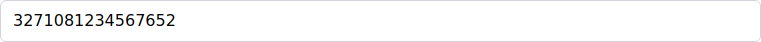

# Panduan Pembukaan Rekening Nasabah Personal untuk Customer Service

**Aplikasi Minibank - Sistem Perbankan Syariah**

---

**Tanggal Pembuatan:** 01 September 2025
**Versi:** 1.0
**Target Pengguna:** Customer Service (CS)
**Status:** Aktif

---

## Daftar Isi

1. [Gambaran Umum](#gambaran-umum)
2. [Prasyarat](#prasyarat)
3. [Langkah-langkah Detail](#langkah-langkah-detail)
   1. [Langkah 1: Login ke Sistem](#langkah-1-login-ke-sistem)
   2. [Langkah 2: Navigasi ke Menu Customer Management](#langkah-2-navigasi-ke-menu-customer-management)
   3. [Langkah 3: Memulai Pembuatan Nasabah Baru](#langkah-3-memulai-pembuatan-nasabah-baru)
   4. [Langkah 4: Mengisi Informasi Pribadi](#langkah-4-mengisi-informasi-pribadi)
   5. [Langkah 5: Mengisi Informasi Kontak](#langkah-5-mengisi-informasi-kontak)
   6. [Langkah 6: Menyimpan dan Verifikasi](#langkah-6-menyimpan-dan-verifikasi)
   7. [Langkah 7: Navigasi ke Pembukaan Rekening](#langkah-7-navigasi-ke-pembukaan-rekening)
   8. [Langkah 8: Menyelesaikan Proses Pembukaan Rekening](#langkah-8-menyelesaikan-proses-pembukaan-rekening)
4. [Video Tutorial](#video-tutorial)
5. [Tips dan Catatan Penting](#tips-dan-catatan-penting)
6. [Pemecahan Masalah Umum](#pemecahan-masalah-umum)

---

## Gambaran Umum

Panduan ini menjelaskan langkah-langkah lengkap untuk membuka rekening nasabah personal menggunakan aplikasi Minibank. Panduan ini ditujukan khusus untuk petugas Customer Service (CS) yang bertugas melayani nasabah dalam proses pembukaan rekening.

**Target Pengguna:** Customer Service (CS)
**Sistem:** Aplikasi Minibank Syariah
**Browser:** Chromium, Firefox, atau WebKit
**Waktu Estimasi:** 5-10 menit per nasabah

---

## Prasyarat

Sebelum memulai proses pembukaan rekening, pastikan:

1. **Akses Sistem**
   - Memiliki username dan password CS yang valid
   - Koneksi internet stabil
   - Browser web yang didukung (Chrome, Firefox, Safari)

2. **Dokumen Nasabah**
   - KTP/Passport asli dan fotokopi
   - NPWP (jika ada)
   - Dokumen pendukung lainnya sesuai kebijakan bank

3. **Informasi Yang Diperlukan**
   - Data pribadi lengkap nasabah
   - Alamat domisili terkini
   - Nomor telepon yang aktif
   - Alamat email (opsional)
   - Setoran awal minimum

---

## Langkah-langkah Detail

### Langkah 1: Login ke Sistem

**Deskripsi:** Masuk ke aplikasi Minibank menggunakan kredensial CS

**Screenshot:**

**Detail Langkah:**

1. Buka halaman login aplikasi Minibank
2. Masukkan username CS Anda (contoh: cs1)
3. Masukkan password yang telah ditentukan
4. Klik tombol "Login" atau tekan Enter
5. Verifikasi bahwa Anda berhasil masuk ke dashboard

---

### Langkah 2: Navigasi ke Menu Customer Management

**Deskripsi:** Akses menu pengelolaan nasabah untuk mulai proses pembukaan rekening

**Screenshot:**

**Detail Langkah:**

1. Dari dashboard utama, cari menu navigasi
2. Pilih atau klik menu "Customer Management" atau "Kelola Nasabah"
3. Sistem akan menampilkan halaman daftar nasabah
4. Pastikan halaman nasabah telah dimuat dengan benar

---

### Langkah 3: Memulai Pembuatan Nasabah Baru

**Deskripsi:** Inisiasi proses pembuatan profil nasabah personal baru

**Screenshot:**

**Detail Langkah:**

1. Pada halaman daftar nasabah, cari tombol "Tambah Nasabah" atau "Add Customer"
2. Klik tombol tersebut untuk memulai proses
3. Sistem akan menampilkan halaman pemilihan jenis nasabah
4. Pilih "Personal Customer" atau "Nasabah Personal"
5. Sistem akan mengarahkan ke formulir pendaftaran nasabah personal

---

### Langkah 4: Mengisi Informasi Pribadi

**Deskripsi:** Lengkapi data pribadi nasabah sesuai dokumen identitas

**Screenshot:**

**Detail Langkah:**

1. Isi field "Nama Depan" sesuai KTP/Passport
2. Isi field "Nama Belakang" (jika ada)
3. Masukkan nomor identitas (KTP/Passport)
4. Pilih jenis identitas dari dropdown menu
5. Isi tanggal lahir dalam format DD/MM/YYYY atau DD-MM-YYYY
6. Masukkan tempat lahir sesuai dokumen
7. Pilih jenis kelamin dari dropdown
8. Isi nama ibu kandung untuk verifikasi keamanan

---

### Langkah 5: Mengisi Informasi Kontak

**Deskripsi:** Lengkapi data kontak dan alamat nasabah

**Screenshot:**

**Detail Langkah:**

1. Masukkan alamat email yang valid (opsional)
2. Isi nomor telepon/handphone yang aktif
3. Masukkan alamat lengkap domisili
4. Isi nama kota tempat tinggal
5. Masukkan kode pos wilayah
6. Isi nama negara (default: Indonesia)
7. Periksa kembali semua data yang telah diisi

---

### Langkah 6: Menyimpan dan Verifikasi

**Deskripsi:** Simpan data nasabah dan verifikasi keberhasilan pembuatan profil

**Screenshot:**

**Detail Langkah:**

1. Pastikan semua field wajib telah terisi dengan benar
2. Klik tombol "Simpan" atau "Save" untuk menyimpan data
3. Tunggu proses penyimpanan selesai
4. Sistem akan menampilkan pesan konfirmasi atau redirect ke halaman detail
5. Verifikasi bahwa nomor nasabah telah digenerate otomatis
6. Catat nomor nasabah untuk proses selanjutnya

---

### Langkah 7: Melihat Daftar Nasabah

**Deskripsi:** Verifikasi nasabah yang telah dibuat tampil di daftar

**Screenshot:**

**Detail Langkah:**

1. Kembali ke halaman daftar nasabah
2. Verifikasi nasabah baru tampil dalam daftar
3. Periksa informasi nasabah sudah benar
4. Siap untuk melanjutkan ke pembukaan rekening

---

### Langkah 8: Rangkuman Tutorial

**Deskripsi:** Ringkasan keseluruhan proses pembukaan rekening nasabah

**Screenshot:**

**Detail Langkah:**

1. Login berhasil dilakukan dengan akun CS
2. Navigasi ke menu Customer Management berhasil
3. Pembuatan nasabah personal berhasil diselesaikan
4. Data nasabah tersimpan dengan baik
5. Siap untuk proses pembukaan rekening selanjutnya

---

## Video Tutorial

Berikut adalah video tutorial yang menunjukkan seluruh proses pembukaan rekening nasabah personal:

### Tutorial Pembukaan Rekening Langkah 1 login as customer service

**File:** [2025-09-01_14-10-07_personalcustomeraccountopeningtutorialtest_tutorial_step_1_login_as_customer_service.webm](videos/2025-09-01_14-10-07_personalcustomeraccountopeningtutorialtest_tutorial_step_1_login_as_customer_service.webm)

> **Catatan:** Untuk memutar video, klik link di atas atau buka file langsung menggunakan browser yang mendukung format WebM.

### Tutorial Pembukaan Rekening Langkah 2 navigate to customer management

**File:** [2025-09-01_14-10-25_personalcustomeraccountopeningtutorialtest_tutorial_step_2_navigate_to_customer_management.webm](videos/2025-09-01_14-10-25_personalcustomeraccountopeningtutorialtest_tutorial_step_2_navigate_to_customer_management.webm)

> **Catatan:** Untuk memutar video, klik link di atas atau buka file langsung menggunakan browser yang mendukung format WebM.

### Tutorial Pembukaan Rekening Langkah 3 start creating new personal customer

**File:** [2025-09-01_14-10-47_personalcustomeraccountopeningtutorialtest_tutorial_step_3_start_creating_new_personal_customer.webm](videos/2025-09-01_14-10-47_personalcustomeraccountopeningtutorialtest_tutorial_step_3_start_creating_new_personal_customer.webm)

> **Catatan:** Untuk memutar video, klik link di atas atau buka file langsung menggunakan browser yang mendukung format WebM.

### Tutorial Pembukaan Rekening Langkah 4 fill personal information

**File:** [2025-09-01_14-11-32_personalcustomeraccountopeningtutorialtest_tutorial_step_4_fill_personal_information.webm](videos/2025-09-01_14-11-32_personalcustomeraccountopeningtutorialtest_tutorial_step_4_fill_personal_information.webm)

> **Catatan:** Untuk memutar video, klik link di atas atau buka file langsung menggunakan browser yang mendukung format WebM.

### Tutorial Pembukaan Rekening Langkah 5 fill contact information

**File:** [2025-09-01_14-12-17_personalcustomeraccountopeningtutorialtest_tutorial_step_5_fill_contact_information.webm](videos/2025-09-01_14-12-17_personalcustomeraccountopeningtutorialtest_tutorial_step_5_fill_contact_information.webm)

> **Catatan:** Untuk memutar video, klik link di atas atau buka file langsung menggunakan browser yang mendukung format WebM.

### Tutorial Pembukaan Rekening Langkah 6 save customer and verify success

**File:** [2025-09-01_14-13-05_personalcustomeraccountopeningtutorialtest_tutorial_step_6_save_customer_and_verify_success.webm](videos/2025-09-01_14-13-05_personalcustomeraccountopeningtutorialtest_tutorial_step_6_save_customer_and_verify_success.webm)

> **Catatan:** Untuk memutar video, klik link di atas atau buka file langsung menggunakan browser yang mendukung format WebM.

### Tutorial Pembukaan Rekening Langkah 7 view customer list and summary

**File:** [2025-09-01_14-13-22_personalcustomeraccountopeningtutorialtest_tutorial_step_7_view_customer_list_and_summary.webm](videos/2025-09-01_14-13-22_personalcustomeraccountopeningtutorialtest_tutorial_step_7_view_customer_list_and_summary.webm)

> **Catatan:** Untuk memutar video, klik link di atas atau buka file langsung menggunakan browser yang mendukung format WebM.

### Tutorial Pembukaan Rekening Langkah 8 tutorial complete summary

**File:** [2025-09-01_14-13-40_personalcustomeraccountopeningtutorialtest_tutorial_step_8_tutorial_complete_summary.webm](videos/2025-09-01_14-13-40_personalcustomeraccountopeningtutorialtest_tutorial_step_8_tutorial_complete_summary.webm)

> **Catatan:** Untuk memutar video, klik link di atas atau buka file langsung menggunakan browser yang mendukung format WebM.

---

## Tips dan Catatan Penting

**Tips untuk Customer Service:**

1. **Verifikasi Data**
   - Selalu cocokkan data dengan dokumen asli
   - Pastikan ejaan nama sesuai dokumen identitas
   - Verifikasi nomor telepon dengan menghubungi nasabah

2. **Keamanan**
   - Jangan simpan informasi sensitif di tempat yang tidak aman
   - Selalu logout setelah selesai melayani nasabah
   - Laporkan aktivitas mencurigakan kepada supervisor

3. **Efisiensi**
   - Siapkan semua dokumen sebelum mulai input
   - Gunakan shortcut keyboard untuk mempercepat proses
   - Manfaatkan fitur auto-complete jika tersedia

4. **Customer Service Excellence**
   - Jelaskan setiap langkah kepada nasabah
   - Berikan informasi tentang produk yang dipilih
   - Pastikan nasabah memahami fitur dan ketentuan rekening

---

## Pemecahan Masalah Umum

**Masalah yang Sering Terjadi:**

1. **Login Gagal**
   - Pastikan username dan password benar
   - Periksa caps lock dan layout keyboard
   - Hubungi IT jika terus gagal login

2. **Form Tidak Bisa Disimpan**
   - Periksa field yang wajib diisi (biasanya ditandai *)
   - Pastikan format tanggal dan nomor sudah benar
   - Refresh halaman dan coba lagi

3. **Nomor Rekening Tidak Ter-generate**
   - Pastikan semua data nasabah sudah tersimpan
   - Periksa koneksi internet
   - Hubungi supervisor jika masalah berlanjut

4. **Error Saat Upload Dokumen**
   - Pastikan format file sesuai (JPG, PNG, PDF)
   - Periksa ukuran file tidak melebihi limit
   - Scan ulang dokumen jika perlu

**Kontak Dukungan:**
- IT Help Desk: ext. 123
- Supervisor CS: ext. 456
- Manager Operasional: ext. 789

---

## Informasi Dokumen

**Dibuat oleh:** Sistem Aplikasi Minibank
**Tanggal:** 01 September 2025
**Versi:** 1.0
**Format:** Markdown (.md)

**Hak Cipta:** © 2025 Aplikasi Minibank - Sistem Perbankan Syariah

---

*Panduan ini dibuat secara otomatis menggunakan Playwright Test Framework dan Java. Untuk pembaruan atau perbaikan, hubungi tim IT atau maintainer sistem.*

**Generator:** UserManualGenerator.java
**Framework:** Playwright + Java
**Template:** Indonesian Banking Documentation Standard
